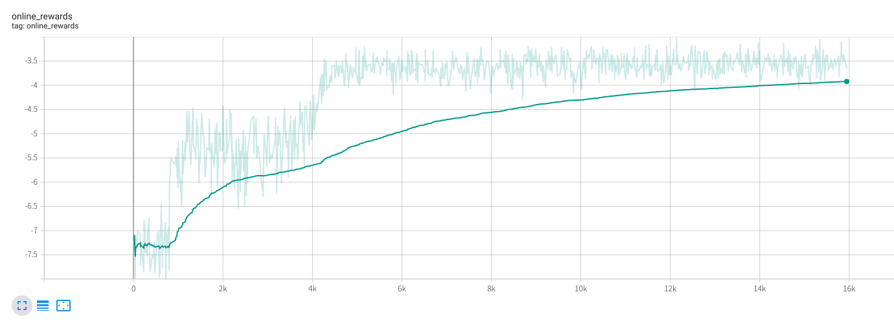
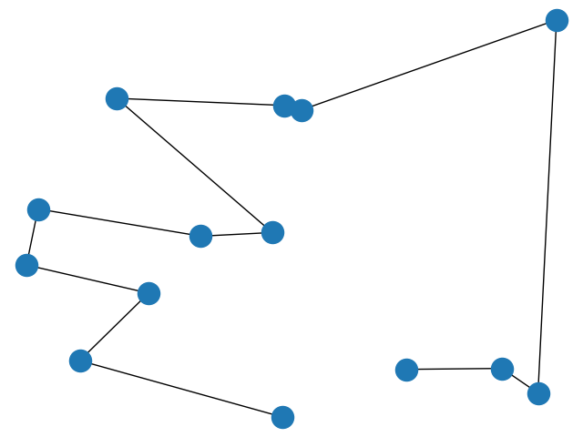

# Attention! Learn to Solve Routing Problems!

Paper: https://arxiv.org/abs/1803.08475

このリポジトリはWouterらの[論文](https://arxiv.org/abs/1803.08475)に多少の改変を加えて実装したリポジトリです。具体的には提案されているTransformerのアーキテクチャに含まれるBatchNormalizationをLayerNormalizationに変更し[こちらの論文](https://arxiv.org/abs/2002.04745)で指摘されているTransformer特有の学習開始時の不安定性に対処するためにPre-LayerNormalizationを採用しています。

これにより学習開始時に非常に小さい学習率で事前学習する必要がなくなります。

# 使い方

特に引数などを指定せずに
```
python reinforce_main.py
```
を実行すれば学習が開始されます。

```
tensorboard --logdir ./logs/
```

とすれば学習中のパフォーマンスを閲覧できます。


高速な学習のため学習及びデモはノード数１４で行われる設定になっています。

単位正方形の中に一様乱数によって生成された１４のノードを巡回する経路の経路長を最小にすることがこのデモの課題です。

学習がうまくいけばonline_rewardは４を切ることになります。

実際に学習したネットワークを使って作成した経路を確認するためには

```
python reinforce_demo.py
```

を実行すれば図のような結果が得られるはずです。



